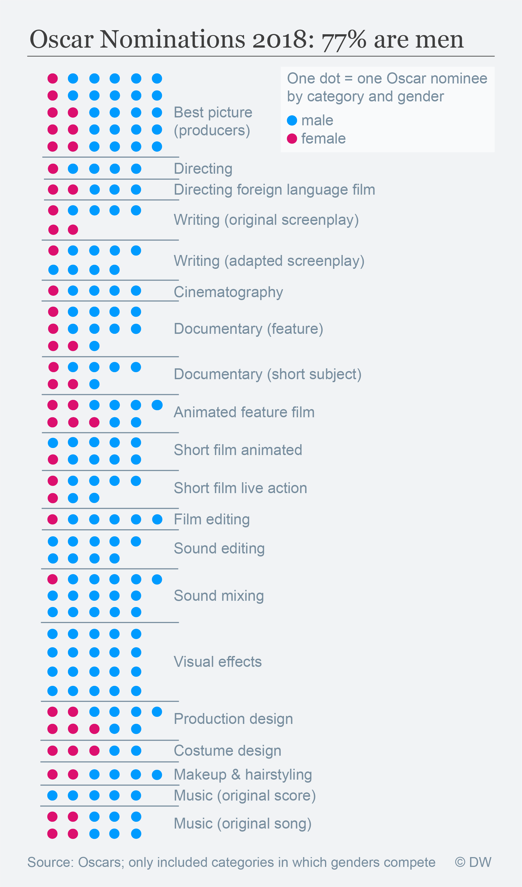

# What's the Oscars' gender ratio?

You can read the story [here](http://p.dw.com/p/2taUI), idea and initial data collection by [Laura Döing](https://www.torial.com/laura.doeing).

For the Oscars 2018 we created a list of all nominees based on the [Oscars website](http://oscar.go.com/nominees). Please note we only included categories in which both genders compete.

We classified all nominees by gender (male = 0, female = 1).

We analysed what the overall gender ratio is: 77 percent of all Oscar nominees are male.

We then had a look at the gender ratio for each category. Please see the [Jupyter Notebook](OscarsSoMale.ipynb) for details

